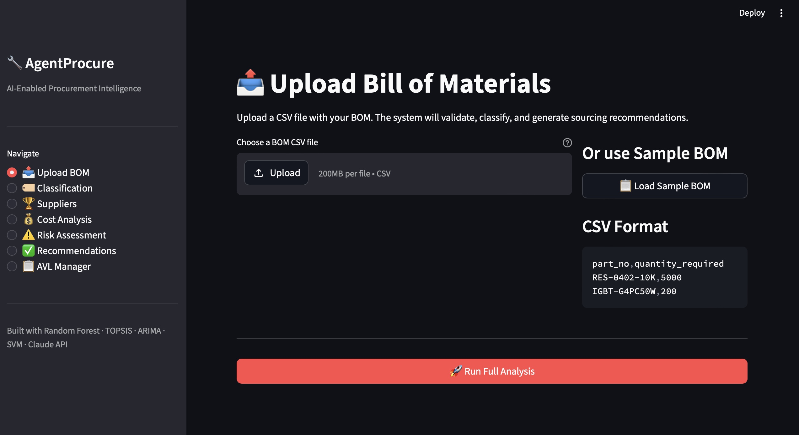
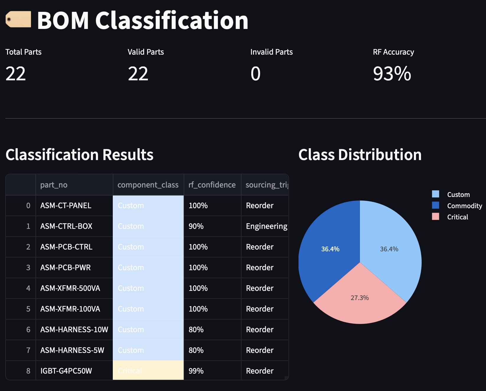
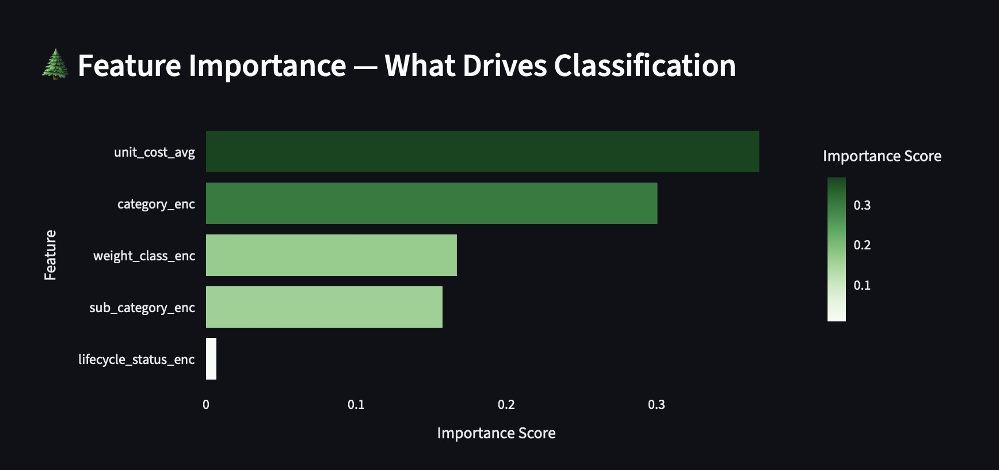
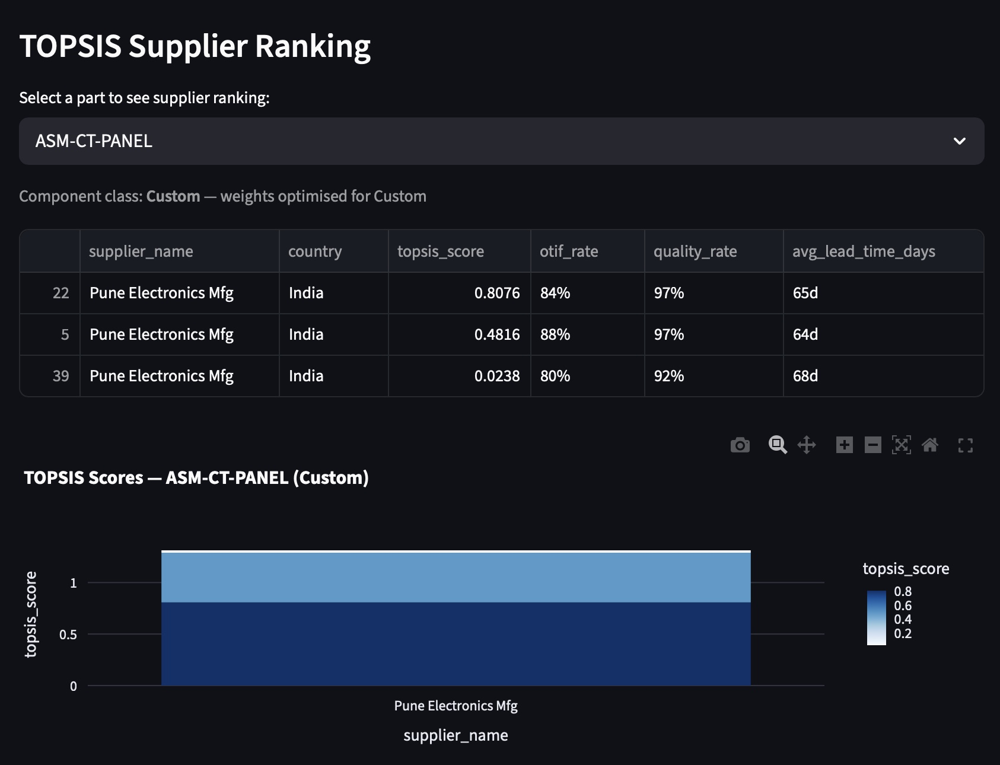
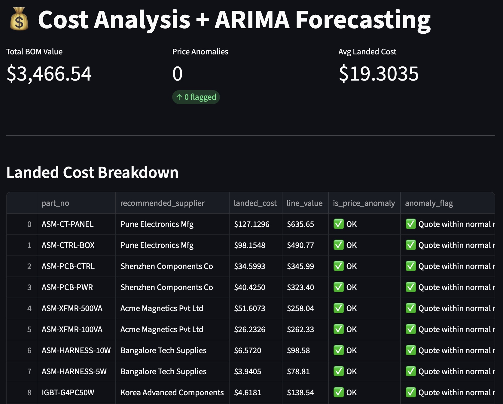
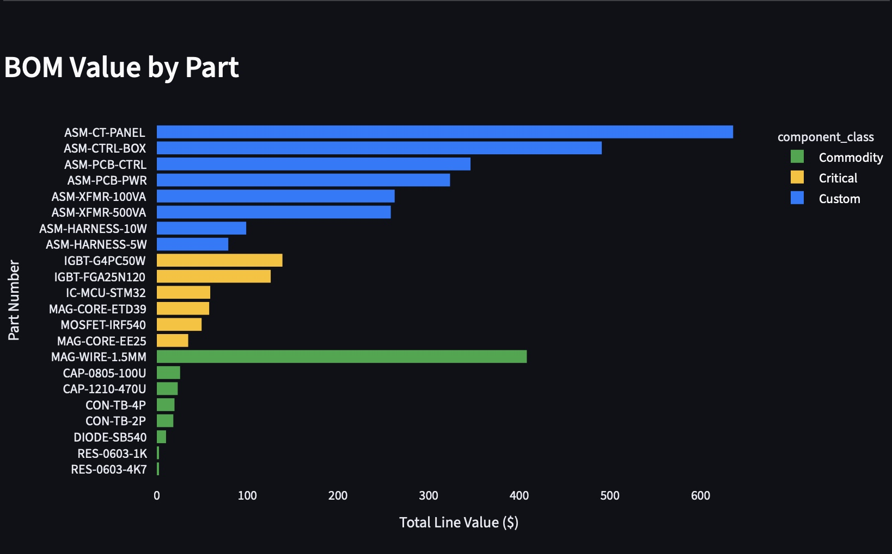
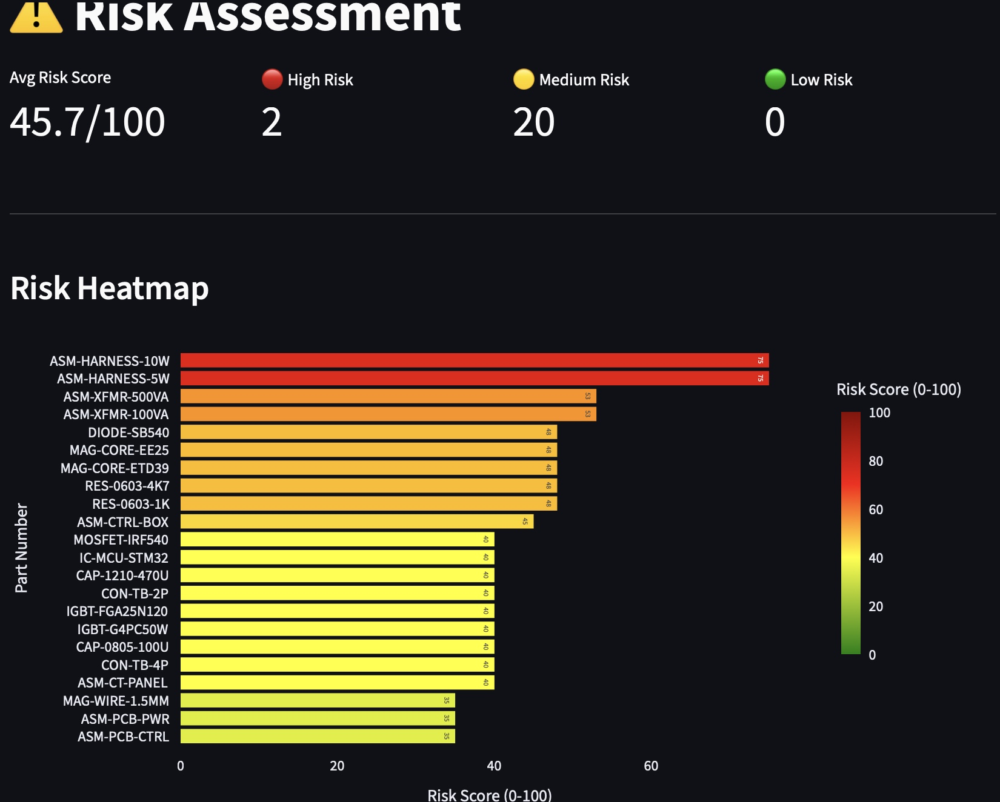
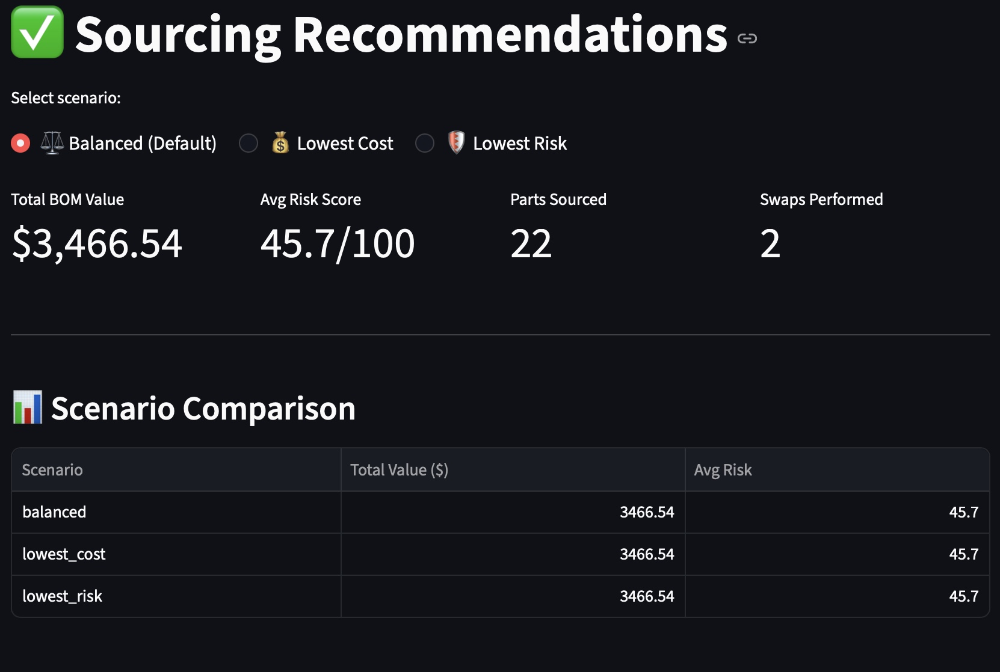
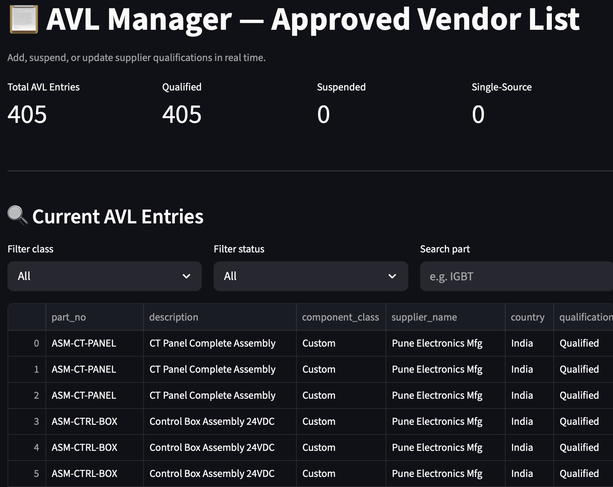
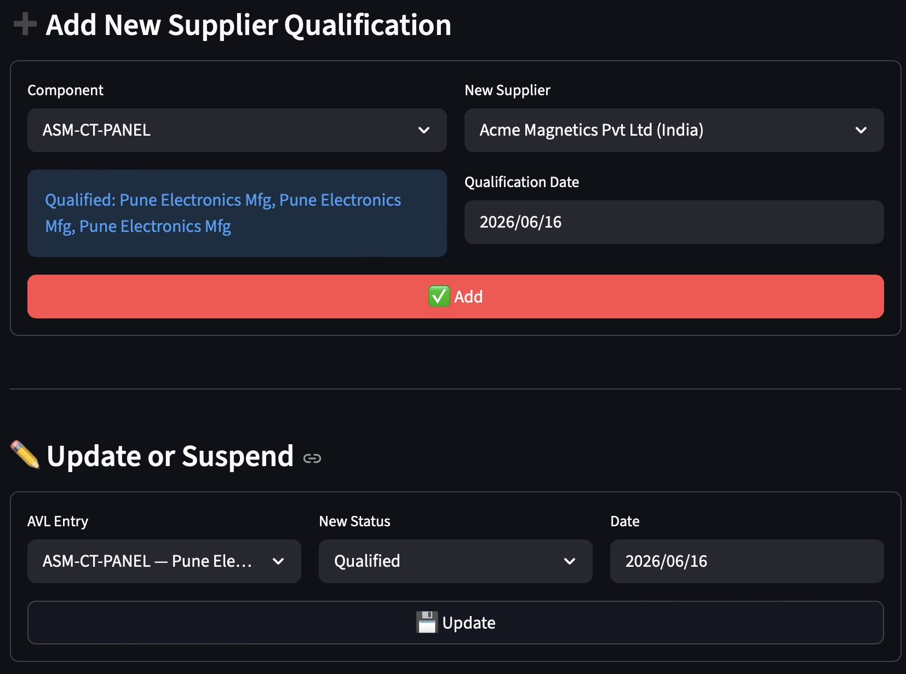

# 🛠️ AgentProcure — AI-Enabled Procurement Decision Intelligence

**AgentProcure** is an end-to-end procurement decision-intelligence system that turns a raw Bill of Materials (BOM) into actionable sourcing recommendations. Upload a BOM and the platform automatically classifies every component, ranks approved suppliers, forecasts landed cost, scores supply risk, and optimizes a sourcing plan across competing objectives (cost vs. risk) — all in an interactive Streamlit dashboard backed by a PostgreSQL procurement dataset.

It combines classical machine learning (Random Forest, K-Means, SVM), multi-criteria decision analysis (TOPSIS), time-series forecasting (ARIMA on live FRED commodity prices), and the Claude API into a single buyer-facing workflow.

---

## 🧰 Tech Stack

| Layer | Technologies |
|---|---|
| **Language** | Python |
| **ML / Analytics** | scikit-learn — **Random Forest**, **K-Means**, **SVM**; **TOPSIS** (multi-criteria ranking); **ARIMA** (price forecasting) |
| **Data** | PostgreSQL, pandas, NumPy |
| **External APIs** | **Claude API** (Anthropic), **FRED API** (commodity prices) |
| **Frontend** | Streamlit + Plotly, streamlit-authenticator |
| **Mock ERP** | FastAPI + Uvicorn |

---

## ✨ Key Features / Problems Solved

- **🏷️ BOM Classification** — a **Random Forest** classifier labels each part as *Commodity / Critical / Custom* and flags its sourcing trigger, with model explainability via feature importance.
- **🏆 Supplier Ranking** — **K-Means** segments suppliers and **TOPSIS** ranks approved vendors per part using class-specific weights over OTIF, quality, lead time, and cost.
- **💰 Cost Analysis & Forecasting** — computes landed cost per line, flags price anomalies, and fits **ARIMA** on **FRED** commodity-price series (aluminum, copper) to forecast future cost.
- **⚠️ Risk Assessment** — an **SVM**-based model scores supply risk (0–100) and produces a risk heatmap across the BOM.
- **✅ Sourcing Optimization** — generates *Balanced / Lowest-Cost / Lowest-Risk* scenarios, performs supplier swaps under constraints, and compares trade-offs (with a reinforcement-learning weight optimizer).
- **📋 AVL Manager** — live management of the Approved Vendor List (add / qualify / suspend suppliers).
- **🔌 ERP Integration** — pushes generated purchase requisitions to a mock ERP service.

---

## 📊 Results & Visualizations

> Metrics below are from a representative run on `sample_bom.csv` (22 parts). See [`results/metrics_summary.md`](results/metrics_summary.md) for the full breakdown.

### Dashboard Overview


### BOM Classification — Random Forest (93% accuracy)


**Class distribution:** Custom 36.4% · Commodity 36.4% · Critical 27.3% · **RF accuracy: 93%**

### Feature Importance — What Drives Classification


Top drivers: `unit_cost_avg`, then `category_enc`.

### Supplier Ranking — TOPSIS


### Cost Analysis + ARIMA Forecasting


**Total BOM value:** $3,466.54 · **Avg landed cost/part:** $19.30 · **Price anomalies:** 0

### BOM Value by Part


### Risk Assessment — SVM Risk Heatmap


**Avg risk score:** 45.7 / 100 · **High-risk parts:** 2 · **Medium:** 20 · **Low:** 0

### Sourcing Recommendations — Optimizer


**Parts sourced:** 22 · **Swaps performed (balanced):** 2

### AVL Manager



### Headline Metrics

| Metric | Value |
|---|---|
| Random Forest classification accuracy | 93% |
| SVM risk model accuracy (in-sample) | 95.9% |
| ARIMA forecast error (MAPE, 3-mo backtest) | 10.4% avg (copper 13.7% · aluminum 7.0%) |
| Cost savings vs. baseline sourcing (sample BOM) | $1,427 (8.5%) |
| Avg landed cost per part | $19.30 |
| Total BOM value (sample run) | $3,466.54 |
| Avg supply-risk score | 45.7 / 100 |
| Parts sourced / supplier swaps (balanced) | 22 / 2 |

---

## 📁 Folder Structure

```
agentprocure/
├── streamlit_app/            # Streamlit dashboard
│   ├── app.py                #   main 6-page dashboard
│   ├── app_auth.py           #   auth-protected variant
│   └── streamlit_app/pages/  #   AVL Manager page
├── modules/                  # Core ML / analytics modules
│   ├── module1_classifier.py #   Random Forest BOM classification
│   ├── module2_supplier.py   #   K-Means + TOPSIS supplier ranking
│   ├── module3_cost.py       #   ARIMA + FRED cost analysis
│   ├── module4_risk.py       #   SVM risk scoring
│   ├── module5_optimizer.py  #   sourcing scenario optimizer
│   └── rl_weight_optimizer.py#   RL bandit weight optimizer
├── database/
│   └── db_connect.py         # PostgreSQL connection helpers (DRY)
├── data/
│   ├── fetch_fred.py         # FRED commodity-price fetcher
│   └── external/             # cached commodity price CSVs
├── synthetic_data/
│   └── generate_data.py      # populates the PostgreSQL dataset
├── erp_mock/                 # FastAPI mock ERP service
│   ├── mock_erp_api.py
│   └── erp_connector.py
├── figures/                  # dashboard result visualizations
├── results/                  # result outputs / metrics summary
├── tests/
├── auth_config.yaml          # dashboard auth config
├── sample_bom.csv            # sample BOM input
├── requirements.txt
└── README.md
```

---

## ⚙️ Installation

```bash
# 1. Clone
git clone https://github.com/nikhilj18/agentprocure.git
cd agentprocure

# 2. Create & activate a virtual environment
python3 -m venv venv
source venv/bin/activate        # Windows: venv\Scripts\activate

# 3. Install dependencies
pip install -r requirements.txt
```

You will also need a running **PostgreSQL** instance and a database named `agentprocure`.

---

## ▶️ How to Run Locally

```bash
# 1. Configure environment variables (see below) in a .env file

# 2. Populate the PostgreSQL dataset (one-time)
python3 synthetic_data/generate_data.py

# 3. (Optional) Refresh FRED commodity prices
python3 data/fetch_fred.py

# 4. Launch the dashboard
streamlit run streamlit_app/app.py
#    Opens at http://localhost:8501

# 5. (Optional) Start the mock ERP API for the integration page
python3 erp_mock/mock_erp_api.py
```

In the dashboard, click **Load Sample BOM** (or upload your own CSV with columns
`part_no,quantity_required`) and run the full analysis.

---

## 🔐 Environment Variables

Create a `.env` file in the project root with the following keys (names only — supply your own values):

```
DB_HOST=
DB_PORT=
DB_NAME=
DB_USER=
DB_PASSWORD=
ANTHROPIC_API_KEY=
FRED_API_KEY=
```

---

## 👤 Author

**Nikhil Sundareshwaran J**
LinkedIn: [linkedin.com/in/nikhil-sundareshwaran-j-a9b30a88](https://www.linkedin.com/in/nikhil-sundareshwaran-j-a9b30a88/)
