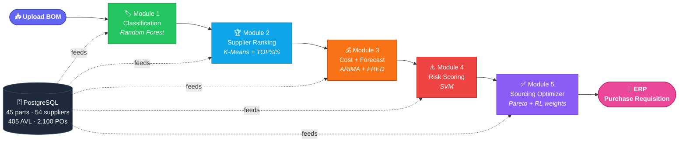

<!-- ░░░░░░░░░░░░░░░░░░░░░░░░ HERO BANNER ░░░░░░░░░░░░░░░░░░░░░░░░ -->
<div align="center">


<p>
  <em>From raw Bill of Materials → classified parts → ranked suppliers → forecasted cost → scored risk → an optimized sourcing plan.</em><br/>
  <strong>One upload. Five ML modules. A buyer-ready recommendation.</strong>
</p>

<!-- ── status / meta badges ── -->
<p>
  
  
  
  
</p>

<!-- ── tech stack badges ── -->
<p>
  
  
  
  
  
  
  
  
  
</p>

</div>

<!-- ░░░░░░░░░░░░░░░░░░░░░░░░ OVERVIEW ░░░░░░░░░░░░░░░░░░░░░░░░ -->
## 🧭 Overview

**AgentProcure** is an end-to-end procurement decision-intelligence system that turns a raw **Bill of Materials (BOM)** into actionable sourcing recommendations. Upload a BOM and the platform automatically **classifies** every component, **ranks** approved suppliers, **forecasts** landed cost, **scores** supply risk, and **optimizes** a sourcing plan across competing objectives (cost vs. risk) — all in an interactive **Streamlit** dashboard backed by a **PostgreSQL** procurement dataset.

It combines classical machine learning (**Random Forest, K-Means, SVM**), multi-criteria decision analysis (**TOPSIS**), time-series forecasting (**ARIMA** on live **FRED** commodity prices), and the **Claude API** into a single buyer-facing workflow.

<div align="center">

| 🎯 93% | 🛡️ 95.9% | 📉 10.4% | 💰 8.5% |
|:---:|:---:|:---:|:---:|
| RF classification accuracy | SVM risk accuracy | ARIMA MAPE | Cost savings vs. baseline |

</div>

<!-- ░░░░░░░░░░░░░░░░░░░░░░░░ PIPELINE ░░░░░░░░░░░░░░░░░░░░░░░░ -->
## 🔄 How It Works



<!-- ░░░░░░░░░░░░░░░░░░░░░░░░ FEATURES ░░░░░░░░░░░░░░░░░░░░░░░░ -->
## ✨ Key Features

| | Module | What it solves |
|:--:|---|---|
| 🏷️ | **BOM Classification** | A **Random Forest** classifier labels each part as *Commodity / Critical / Custom* and flags its sourcing trigger — with explainability via feature importance. |
| 🏆 | **Supplier Ranking** | **K-Means** segments suppliers; **TOPSIS** ranks approved vendors per part using class-specific weights over OTIF, quality, lead time, and cost. |
| 💰 | **Cost Analysis & Forecasting** | Computes landed cost per line, flags price anomalies, and fits **ARIMA** on **FRED** commodity series (copper, aluminum) to forecast future cost. |
| ⚠️ | **Risk Assessment** | An **SVM** model scores supply risk (0–100) and renders a risk heatmap across the BOM. |
| ✅ | **Sourcing Optimization** | Generates *Balanced / Lowest-Cost / Lowest-Risk* scenarios, performs constraint-aware supplier swaps, and compares trade-offs (with an RL weight optimizer). |
| 📋 | **AVL Manager** | Live management of the Approved Vendor List — add / qualify / suspend suppliers. |
| 🔌 | **ERP Integration** | Pushes generated purchase requisitions to a mock ERP service. |

<!-- ░░░░░░░░░░░░░░░░░░░░░░░░ TECH STACK ░░░░░░░░░░░░░░░░░░░░░░░░ -->
## 🧰 Tech Stack

<div align="center">

| Layer | Technologies |
|:--|:--|
| 🐍 **Language** | Python |
| 🤖 **ML / Analytics** | scikit-learn — **Random Forest**, **K-Means**, **SVM** · **TOPSIS** · **ARIMA** |
| 🗄️ **Data** | PostgreSQL · pandas · NumPy |
| 🌐 **External APIs** | **Claude API** (Anthropic) · **FRED API** (commodity prices) |
| 📊 **Frontend** | Streamlit · Plotly · streamlit-authenticator |
| ⚡ **Mock ERP** | FastAPI · Uvicorn |

</div>

<!-- ░░░░░░░░░░░░░░░░░░░░░░░░ RESULTS ░░░░░░░░░░░░░░░░░░░░░░░░ -->
## 📊 Results & Visualizations

> 📌 Metrics below are from a representative run on `sample_bom.csv`. Full breakdown in [`results/metrics_summary.md`](results/metrics_summary.md).

<div align="center">

### 🖥️ Dashboard Overview


<br/><br/>

### 🏷️ BOM Classification — Random Forest (93% accuracy)


`Custom 36.4%` · `Commodity 36.4%` · `Critical 27.3%` · **RF accuracy: 93%**

<br/><br/>

### 🌲 Feature Importance — What Drives Classification


Top drivers: `unit_cost_avg` → `category_enc`

<br/><br/>

### 🏆 Supplier Ranking — TOPSIS


<br/><br/>

### 💰 Cost Analysis + ARIMA Forecasting


**Total BOM value:** $3,466.54 · **Avg landed cost/part:** $19.30 · **Price anomalies:** 0

<br/><br/>

### 📦 BOM Value by Part


<br/><br/>

### ⚠️ Risk Assessment — SVM Risk Heatmap


**Avg risk score:** 45.7 / 100 · 🔴 **High:** 2 · 🟡 **Medium:** 20 · 🟢 **Low:** 0

<br/><br/>

### ✅ Sourcing Recommendations — Optimizer


**Parts sourced:** 22 · **Swaps performed (balanced):** 2

<br/><br/>

### 📋 AVL Manager


</div>

### 🎯 Headline Metrics

| Metric | Value |
|---|:--:|
| 🏷️ Random Forest classification accuracy | **93%** |
| 🛡️ SVM risk model accuracy *(in-sample)* | **95.9%** |
| 📉 ARIMA forecast error (MAPE, 3-mo backtest) | **10.4% avg** *(copper 13.7% · aluminum 7.0%)* |
| 💰 Cost savings vs. baseline sourcing *(sample BOM)* | **$1,427 (8.5%)** |
| 🧾 Avg landed cost per part | **$19.30** |
| 📦 Total BOM value *(sample run)* | **$3,466.54** |
| ⚠️ Avg supply-risk score | **45.7 / 100** |
| 🔁 Parts sourced / supplier swaps *(balanced)* | **22 / 2** |

<!-- ░░░░░░░░░░░░░░░░░░░░░░░░ STRUCTURE ░░░░░░░░░░░░░░░░░░░░░░░░ -->
## 📁 Project Structure

```
agentprocure/
├── 📊 streamlit_app/            # Streamlit dashboard
│   ├── app.py                   #   main 6-page dashboard
│   ├── app_auth.py              #   auth-protected variant
│   └── streamlit_app/pages/     #   AVL Manager page
├── 🤖 modules/                  # Core ML / analytics modules
│   ├── module1_classifier.py    #   Random Forest BOM classification
│   ├── module2_supplier.py      #   K-Means + TOPSIS supplier ranking
│   ├── module3_cost.py          #   ARIMA + FRED cost analysis
│   ├── module4_risk.py          #   SVM risk scoring
│   ├── module5_optimizer.py     #   sourcing scenario optimizer
│   └── rl_weight_optimizer.py   #   RL bandit weight optimizer
├── 🗄️ database/db_connect.py    # PostgreSQL connection helpers (DRY)
├── 🌐 data/
│   ├── fetch_fred.py            # FRED commodity-price fetcher
│   └── external/                # cached commodity price CSVs
├── 🧪 synthetic_data/           # populates the PostgreSQL dataset
├── ⚡ erp_mock/                 # FastAPI mock ERP service
├── 🖼️ figures/                  # dashboard result visualizations
├── 📈 results/                  # result outputs / metrics summary
├── 🔑 auth_config.yaml          # dashboard auth config
├── 📄 sample_bom.csv            # sample BOM input
└── 📦 requirements.txt
```

<!-- ░░░░░░░░░░░░░░░░░░░░░░░░ SETUP ░░░░░░░░░░░░░░░░░░░░░░░░ -->
## 🚀 Getting Started

<details open>
<summary><strong>⚙️ Installation</strong></summary>

```bash
# 1. Clone
git clone https://github.com/nikhilj18/agentprocure.git
cd agentprocure

# 2. Create & activate a virtual environment
python3 -m venv venv
source venv/bin/activate        # Windows: venv\Scripts\activate

# 3. Install dependencies
pip install -r requirements.txt
```

> You will also need a running **PostgreSQL** instance and a database named `agentprocure`.

</details>

<details>
<summary><strong>▶️ Run Locally</strong></summary>

```bash
# 1. Configure environment variables (see below) in a .env file

# 2. Populate the PostgreSQL dataset (one-time)
python3 synthetic_data/generate_data.py

# 3. (Optional) Refresh FRED commodity prices
python3 data/fetch_fred.py

# 4. Launch the dashboard  →  http://localhost:8501
streamlit run streamlit_app/app.py

# 5. (Optional) Start the mock ERP API for the integration page
python3 erp_mock/mock_erp_api.py
```

In the dashboard, click **Load Sample BOM** (or upload your own CSV with columns `part_no,quantity_required`) and run the full analysis.

</details>

<details>
<summary><strong>🔐 Environment Variables</strong></summary>

Create a `.env` file in the project root with these keys (names only — supply your own values):

```env
DB_HOST=
DB_PORT=
DB_NAME=
DB_USER=
DB_PASSWORD=
ANTHROPIC_API_KEY=
FRED_API_KEY=
```

</details>

<!-- ░░░░░░░░░░░░░░░░░░░░░░░░ AUTHOR ░░░░░░░░░░░░░░░░░░░░░░░░ -->
## 👤 Author

<div align="center">

**Nikhil Sundareshwaran J**

<a href="https://www.linkedin.com/in/nikhil-sundareshwaran-j-a9b30a88/">
  
</a>

<br/><br/>


</div>
